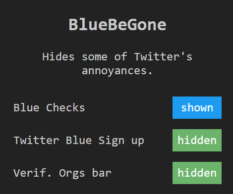

# BlueBeGone
Drastic times call for drastic measures. BlueBeGone Chrome extension gives you the option of removing the infamous blue checks, as well as the annoying "Twitter Blue" and "Verified Organizations" sidebar links.

This project is a natural evolution of [DogeBeGone](https://github.com/SableRaf/dogeBeGone_extension), originally by [Raphaël](https://twitter.com/sableRaph). The main idea is the same, make twitter just a bit less annoying.

## Installation

To install BlueBeGone locally, follow these steps:

1. Download the repo as zip and extract it, or just clone it. You may want to remove the .git folder since it's unnecessary.
2. Open the Chrome browser and navigate to `chrome://extensions`.
3. Enable "Developer mode" by clicking the toggle switch in the top right corner.
4. Click "Load unpacked" and select the folder containing the BlueBeGone Chrome extension files.

By default, the extension is enabled. To disable it, click the extension icon in the top right corner of the browser and click the toggle button.

## Contributing

Feel free to contribute to this project in any way you see fit. Submit a PR, open an issue, or message me on [Twitter](https://twitter.com/patakk).

## License

BlueBeGone is licensed under the [GNU General Public License v3.0](https://www.gnu.org/licenses/gpl-3.0.en.html).
