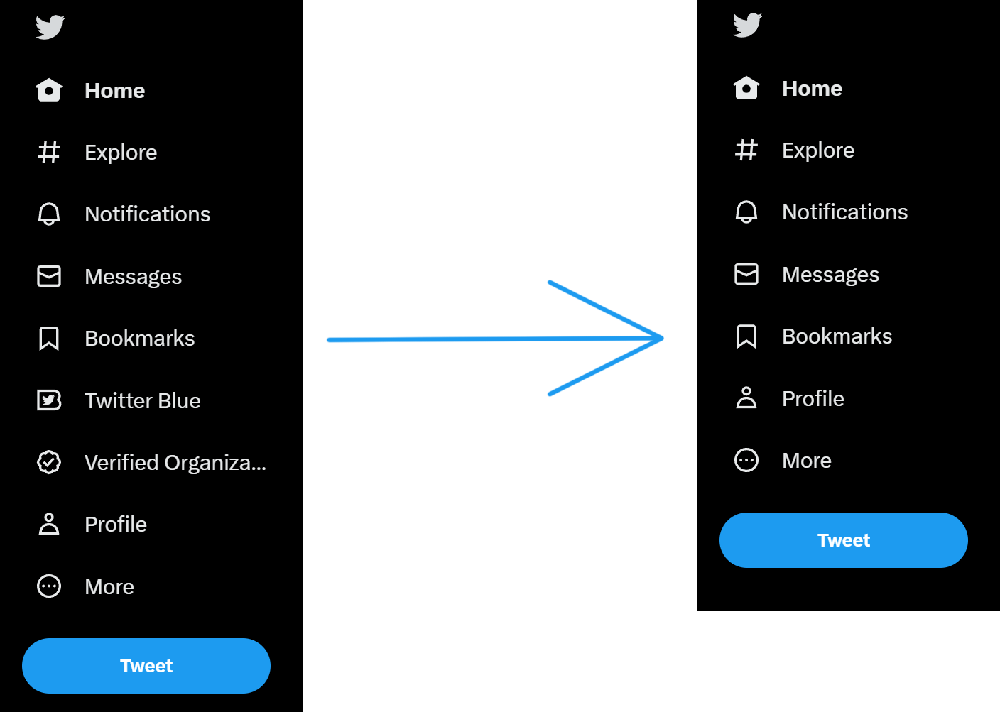

# BlueBeGone
Drastic times call for drastic measures. This Chrome extensions removes the very useful "Twitter Blue" and "Verified Org..." sidebar links.
This project is a natural evolution of [DogeBeGone](https://github.com/SableRaf/dogeBeGone_extension). Much of the project structure, code and README are based on that project, with modifications like adding a toggle button for simpler use, gray icons and of course the main target (links instead of the doge icon).

## Installation

To install BlueBeGone locally, follow these steps:

1. Clone this repository or download it as a zip file and extract it.
2. Open the Chrome browser and navigate to `chrome://extensions`.
3. Enable "Developer mode" by clicking the toggle switch in the top right corner.
4. Click "Load unpacked" and select the folder containing the BlueBeGone Chrome extension files.

Now, you can enjoy Twitter without being distracted by a dead meme from 2013.

## Contributing

Feel free to contribute to this project in any way you see fit. Submit a PR, open an issue, or message me on [Twitter](https://twitter.com/patakk).

## License

BlueBeGone is licensed under the [GNU General Public License v3.0](https://www.gnu.org/licenses/gpl-3.0.en.html).
